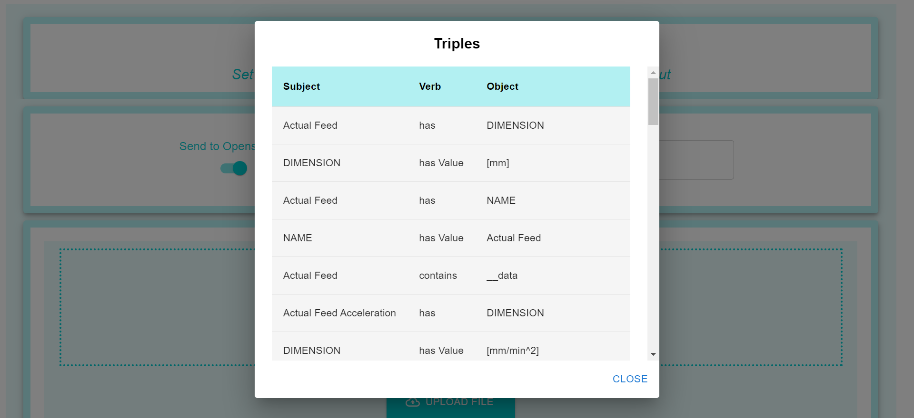
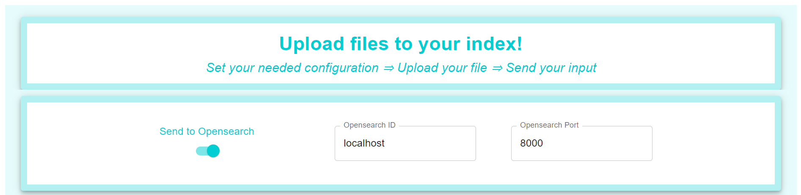
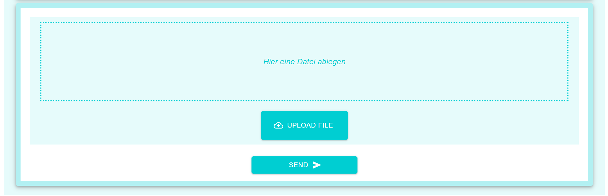

# Upload

During my work as a research assistant at FZI, I was responsible for designing and implementing a front-end that facilitates the upload of data in a specific structure. This data is sent to the server, processed, and then displayed as triples, as shown in the first image. I developed the front-end using ReactJS, focusing on creating a user-friendly interface that allows efficient and flexible handling of the data. Additionally, I integrated semantic search functions to enable targeted and intuitive search within the data.

